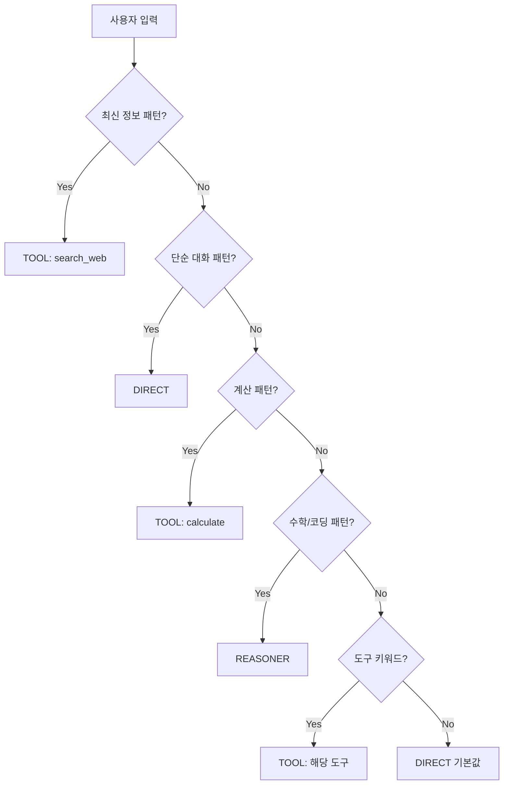
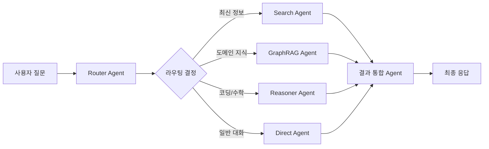

# 라우팅 및 쿼리 분해 최적화 기술 보고서

> **작성일**: 2026-01-29 (Updated)  
> **프로젝트**: MoA-PoC (Tiny MoA)  
> **작성자**: Antigravity

---

## 1. 개요 및 배경

Tiny MoA의 반응 속도와 효율성을 극대화하기 위해, 기존의 전적인 LLM 의존 방식을 탈피하고 **정교한 휴리스틱(Heuristic) + LLM 하이브리드** 방식으로 전환하기 위한 연구를 진행했습니다. 
특히 사용자 질문을 적절한 도구/전문가에게 연결하는 **라우팅(Routing)**과 복잡한 질문을 쪼개는 **쿼리 분해(Decomposition)** 단계에서의 최적화에 집중했습니다.

### 핵심 설계 원칙

> [!IMPORTANT]
> **라우팅 3원칙**
> 1. **REASONER**는 **수학적 추론** 및 **순수 코딩 작업**에만 사용 (함수 작성, 알고리즘 구현, 버그 수정 등)
> 2. **TOOL**은 **외부 정보 조회**가 필요한 경우 (웹 검색, 날씨, 뉴스, 최신 정보, 시스템 명령)
> 3. **DIRECT**는 그 외 **모든 일반 대화** (인사, 감사, 요약, 번역, 설명, 계획 수립 등) - **기본값**

## 2. 실험 결과 (Benchmarking)

32개의 다양한 테스트 케이스(일반 대화, 날씨/뉴스 검색, 코딩, 최신 정보, 복합 계획 등)를 대상으로 LLM(LFM2.5)과 최적화된 휴리스틱 로직(v3)을 비교했습니다.

| 항목 | 휴리스틱 (v3) | LLM (LFM2.5) | 비고 |
|:---:|:---:|:---:|:---|
| **라우팅 정확도** | **96.9%** (31/32) | 62.5% (20/32) | 휴리스틱이 오분류가 훨씬 적음 |
| **분해 정확도** | **100%** (17/17) | 94.1% (16/17) | 휴리스틱이 더 안정적임 |
| **평균 소요 시간** | **1.1 ms** | ~25,000 ms | **약 11,000 ~ 23,000배 빠름** |

### 주요 발견
1. **LLM의 한계**: 학습 데이터 컷오프 이후의 최신 정보(e.g., Claude 4, 2024년 노벨상)를 모른 채 `DIRECT`(대화)나 `REASONER`(추론)로 잘못 분류하는 경향이 있음.
2. **휴리스틱의 강점**: 정규표현식 기반의 패턴 매칭을 통해 연도, 버전, 기술 용어를 100% 감지하여 정확하게 검색(`TOOL`)으로 유도함.

## 3. 최적화된 로직 (Algorithm)

현재 `src/tiny_moa/brain.py`에 적용된 로직은 다음과 같습니다.

### 3.1 라우팅 (Routing)
우선순위(Fast Path) 기반으로 LLM 호출 없이 즉시 판단합니다.



1.  **Fast Path 0 (최신 정보 감지)**: `TOOL` (search_web)
    *   2023년 이후 연도 (`202[3-9]`)
    *   버전 넘버링 (`v2.0`, `GPT-5`, `Claude 4`)
    *   최신 키워드 (`최신`, `latest`, `오늘`)
2.  **Fast Path 0.1 (단순 대화)**: `DIRECT`
    *   인사, 감사, 작별, 요약/번역/설명 요청
    *   *예외 처리*: "뭐야?" 질문 속에 기술 용어(Docker, UV 등)가 있으면 `DIRECT`가 아닌 `TOOL`로 보냄.
3.  **Fast Path 0.5 (계산)**: `TOOL` (calculate)
    *   사칙연산 키워드 감지
4.  **Fast Path 1 (전문가 추론)**: `REASONER`
    *   **수학/코딩 전용**: `함수 작성`, `알고리즘 구현`, `버그 찾기`, `디버깅`, `SQL 쿼리`, `피보나치`, `AIME 문제`
    *   ⚠️ `계획`, `요약`, `설명` 등은 REASONER가 아닌 **DIRECT** 처리
5.  **Fast Path 2 (일반 도구)**: `TOOL`
    *   날씨, 뉴스, 검색, 시간, 명령 실행 등 명시적 키워드
6.  **Fallback**: 위 패턴에 해당하지 않는 경우 → **DIRECT** (LLM 호출 최소화)

### 3.2 쿼리 분해 (Decomposition)
LLM을 사용하지 않고 100% 규칙 기반으로 처리합니다.

1.  **토픽 감지**: 입력 쿼리에서 주요 토픽(날씨, 뉴스, 주가, 시간, 계산 등)을 식별.
2.  **엔티티 추출**: 조사(은/는/이/가)와 문장 부호를 제거하고 핵심 명사(도시명, 기업명 등)만 추출.
3.  **다중 쿼리 생성**: 
    *   "서울과 부산 날씨" → `["서울 날씨", "부산 날씨"]`
    *   비교 요청(VS, 차이) 감지 시 마지막에 `"Compare results"` 태스크 추가.

### 3.3 작업 분해 확장 (향후 목표)

> [!NOTE]
> 현재 쿼리 분해는 단일 토픽 내 엔티티 분리에 집중되어 있습니다. 
> 향후에는 **다중 작업 파이프라인**을 지원해야 합니다.

**예시: "최신 AI 트렌드 검색해서 요약해줘"**
```
[ 
  {"action": "TOOL", "tool": "search_web", "query": "최신 AI 트렌드 2026"},
  {"action": "DIRECT", "task": "검색 결과를 한국어로 요약"}
]
```

**다중 라우팅 파이프라인:**
1. 최신 정보 감지 → `TOOL` (웹 검색)
2. 검색 결과 수신 후 → `DIRECT` (요약/해석)
3. 필요시 → `REASONER` (코드 생성이 필요한 경우만)

## 4. 코드 적용 및 테스트 방법

### 코드 적용
이미 `c:\github\MoA-PoC\src\tiny_moa\brain.py`에 최적화된 코드가 적용되어 있습니다. 별도의 설정 변경 없이 `main.py`를 실행하면 즉시 적용됩니다.

### 테스트 실행
최적화된 성능을 검증하기 위한 테스트 스크립트들이 준비되어 있습니다.

```bash
# 1. LLM vs 휴리스틱 전체 비교 (라우팅 + 분해)
python -m src.function_tests.test_full_comparison

# 2. 결과 확인
# 실행 후 생성되는 full_comparison_results.json 확인
```

## 5. 한계 및 장단점

### 장점 (Pros)
1.  **압도적인 속도**: 로컬 LLM 로딩 및 추론 시간(수십 초)을 0.001초 단위로 단축.
2.  **비용 절감**: 상용 API 사용 시 토큰 비용 0.
3.  **제어 가능성**: 개발자가 의도한 대로 정확하게 동작하도록 강제할 수 있음 (예: 특정 버전 질문은 무조건 검색).
4.  **최신성 커버**: LLM이 모르는 최신 키워드도 패턴으로 잡아내어 검색으로 연결 가능.

### 단점 및 한계 (Cons)

> [!WARNING]
> 아래 한계점들은 GraphRAG 도입 및 다중 라우팅으로 해결 가능

1.  **유연성 부족**: 미리 정의되지 않은 패턴이나 오타, 사투리, 모호한 표현에 취약.
    *   예: "쥐피티 오버 나왔어?" → 'GPT-5' 패턴 매칭 실패 가능성
    *   **해결: Fuzzy Matching 또는 SLM 분류기 도입**
2.  **유지보수 비용**: 새로운 신조어나 기술이 나올 때마다 `brain.py`의 키워드 리스트 수동 업데이트 필요.
    *   **해결: 동적 키워드 DB 또는 외부 트렌드 API 연동**
3.  **문맥 이해 부재**: 앞뒤 대화 맥락을 고려해야 하는 복잡한 라우팅에는 한계.
    *   **해결: 대화 히스토리 기반 라우팅 (Stateful Router)**
4.  **단일 작업 제한**: 현재는 하나의 라우팅 결과만 반환.
    *   **해결: 다중 라우팅 파이프라인 (Section 7 참조)**

## 6. 향후 고도화 전략: LoRA Fine-tuning

만약 휴리스틱의 한계(유연성 부족)를 극복하고 LLM의 지능을 활용하면서 속도를 챙기기 위해 **SLM(Small Language Model)을 LoRA로 파인튜닝**한다면 다음 전략을 권장합니다.

### 6.1 목표
*   **Target**: TinyLlama-1.1B, Qwen-1.5B, 또는 Gemma-2B 수준의 초경량 모델.
*   **Task**: 복잡한 추론 없이 입력 문장을 보고 `TOOL`, `DIRECT`, `REASONER` 3가지 클래스 중 하나로 즉시 분류 (Sequence Classification 또는 Token Generation).

### 6.2 데이터셋 구성 전략
휴리스틱이 실패하기 쉬운 **"모호한 경계"** 데이터를 집중적으로 학습시켜야 합니다.

1.  **Input**: 사용자 쿼리
2.  **Output**: `{"route": "TOOL", "service": "search_web"}` 형태의 JSON 또는 단순 태그 `<TOOL>search_web</TOOL>`

| 카테고리 | 예시 데이터 | 라벨 | 의도 |
|:---:|:---|:---:|:---|
| **최신 정보** | "프롬프트 엔지니어링 2025 트렌드 알려줘" | `TOOL` | 연도/최신 키워드 학습 |
| **모호한 질문** | "이거 어떻게 생각해?" (문맥 필요) | `DIRECT` | 일반 대화 능력 |
| **복합 명령** | "어제 뉴스 요약해서 보고서 써줘" | `TOOL → DIRECT` | **다중 라우팅** |
| **사투리/오타** | "낼씨 어뗘?" | `TOOL` | 강건성 확보 |
| **계획 수립** | "이 프로젝트 어떻게 진행할까?" | `DIRECT` | REASONER 아님! |

### 6.3 학습 포인트
*   **Overfitting 활용**: 라우팅은 창의성이 필요 없으므로, 특정 키워드에 과적합되어도 상관없음. 오히려 빠릿한 분류가 중요.
*   **Quantization**: 4bit 양자화된 상태로 서빙하여 CPU에서도 100ms 이내 응답 목표.
*   **Hybrid 유지**: LoRA 모델 앞단에 여전히 "명백한 패턴(Weather 등)"은 휴리스틱으로 남겨두어 리소스 낭비 방지.

## 7. 향후 확장: GraphRAG 기반 다중 에이전트 시스템

> [!TIP]
> **참고 자료**: [Google ADK + Neo4j GraphRAG Codelab](https://codelabs.developers.google.com/neo4j-adk-graphrag-agents)

### 7.1 GraphRAG란?

기존 RAG(Retrieval-Augmented Generation)가 단순 벡터 유사도 검색에 의존하는 반면, **GraphRAG**는 지식 그래프의 관계 구조를 활용합니다:

- **다중 홉 추론**: 엔티티 간 복잡한 관계 탐색 가능
- **설명 가능한 결과**: 연결된 데이터 기반 근거 제시
- **구조적 컨텍스트**: 그래프 구조를 통한 문맥 이해

### 7.2 Tiny MoA에 적용 방안



**다중 에이전트 아키텍처:**
1. **Router Agent (현재 Brain)**: 오케스트레이터 역할, 하위 에이전트 선택
2. **Search Agent**: 웹 검색, 뉴스 검색 전담
3. **GraphRAG Agent**: 구조화된 지식 그래프 쿼리 (추후 Neo4j 연동)
4. **Reasoner Agent**: 수학/코딩 전문 (현재 Reasoner)
5. **Direct Agent**: 일반 대화 (현재 Brain의 direct_respond)

### 7.3 MCP Toolbox 패턴 적용

Google의 MCP(Model Context Protocol) Toolbox 방식을 참고하여:
- **사전 검증된 쿼리**: LLM이 직접 쿼리 생성 대신 미리 정의된 안전한 쿼리 템플릿 사용
- **파라미터 검증**: 입력값 유효성 검사
- **중앙 관리**: 쿼리 템플릿을 한 곳에서 관리하여 유지보수성 향상

```python
# 예시: MCP 스타일 도구 정의
TOOL_DEFINITIONS = {
    "search_news": {
        "description": "최신 뉴스 검색",
        "parameters": {"query": "str", "limit": "int=5"},
        "pre_validated": True
    },
    "get_weather": {
        "description": "날씨 조회",
        "parameters": {"city": "str"},
        "pre_validated": True
    }
}
```

### 7.4 구현 로드맵

| 단계 | 작업 내용 | 상태 |
|:---:|:---|:---:|
| 1 | 휴리스틱 라우팅 v3 | ✅ 완료 |
| 2 | 다중 라우팅 파이프라인 | 🔄 계획 중 |
| 3 | 대화 히스토리 기반 라우팅 | 📋 예정 |
| 4 | GraphRAG 프로토타입 (Neo4j) | 📋 예정 |
| 5 | LoRA 기반 SLM 라우터 | 📋 예정 |

---

## 8. 결론

**현재 단계(PoC)에서는 휴리스틱 v3가 최고의 가성비와 성능을 보여줍니다.** 

핵심 요약:
- **REASONER**: 수학/코딩 전용 (그 외 모든 경우는 DIRECT)
- **TOOL**: 외부 정보 필요 시 (검색, 날씨, 뉴스, 시스템 명령)
- **DIRECT**: 기본값 (인사, 감사, 계획, 요약, 번역 등)

서비스 규모가 커져 패턴 관리가 불가능해질 때:
1. **LoRA 기반 SLM 분류기** 도입
2. **GraphRAG**로 도메인 지식 확장
3. **다중 에이전트 시스템**으로 전환
